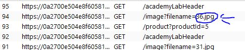
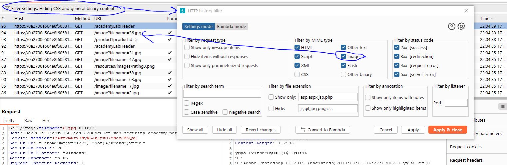
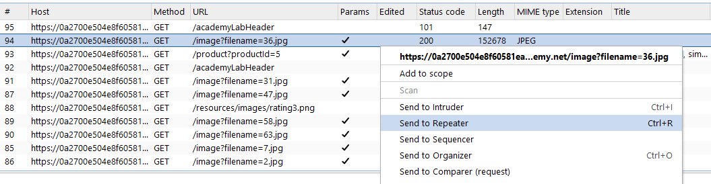
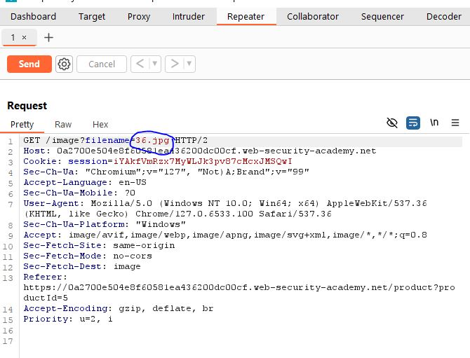
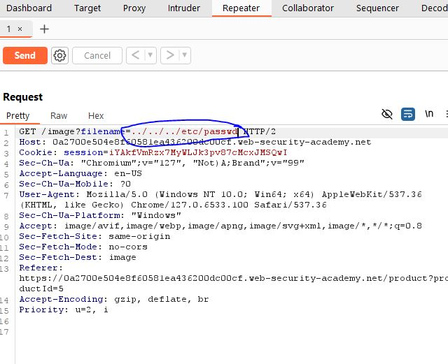
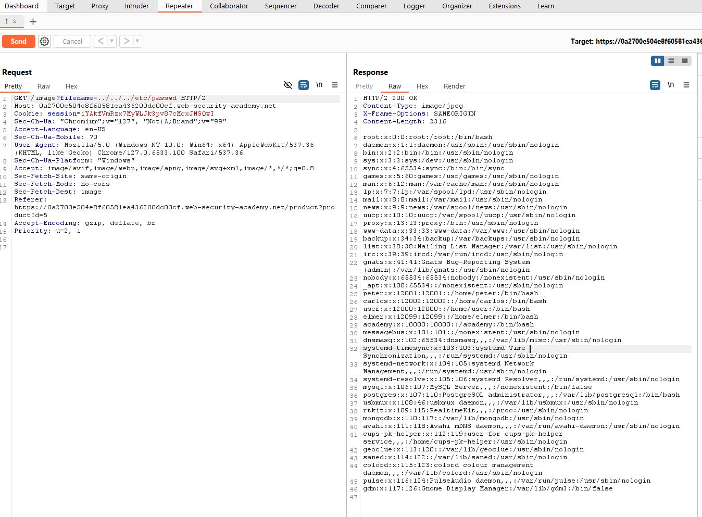

# File path traversal, simple case
In this lab, we'll exploit a web application's lack of defenses against path traversal attacks.

## Steps

1. **Visit the Target Site**
   - Use Burp Suite to visit the target website.
   - In Burp Suite, observe the requests made by the site, noting images loaded via their file directories.
   
   - **Note:** Ensure "Images" is selected in the history filter to view these requests.
   

2. **Identify the Exploit Method**
   - Right-click the image request and send it to the Repeater. This request will be used to test the path traversal vulnerability.
   

3. **Modify the Request**
   - In the Repeater tab, change the file path to `../../../etc/passwd` to target the system's passwd file.
    

4. **Execute the Exploit**
   - Send the modified request. If successful, you will receive the contents of the root `passwd` file.
   

Congratulations, you have successfully completed the first lab in the Server-Side Vulnerabilities learning path!
