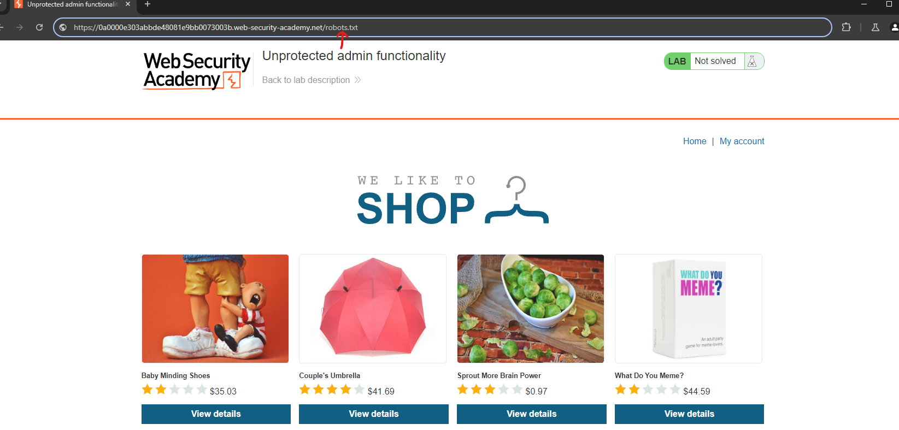
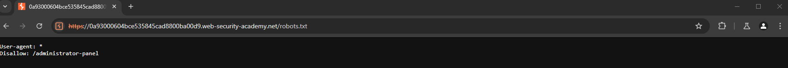
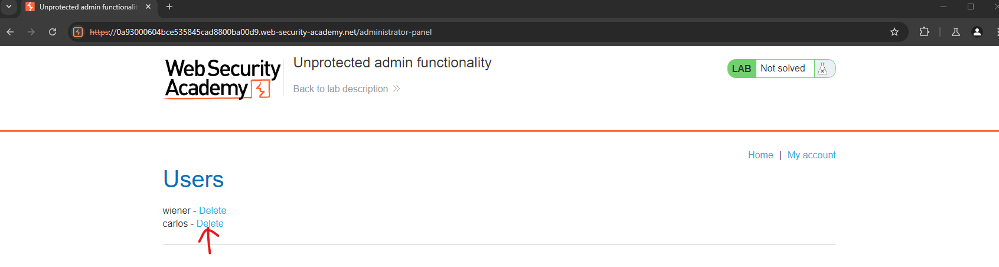

## Unprotected admin functionality
### Overview
In this writeup, we exploit a path traversal vulnerability by redirecting to the target directory instead of directly invoking a function to print the file. This technique allows us to navigate the website's directory structure, ultimately gaining access to restricted areas and completing the challenge.

### Step 1: Accessing `robots.txt`

We start by appending `/robots.txt` to the URL, taking advantage of the lack of proper defenses against path traversal.

```
http://example.com/robots.txt
```

By accessing this page, we can gain insights into the site's directory structure and hidden paths.



### Step 2: Navigating to the Administrator Panel

Inside the `robots.txt` file, we discover a path leading to the administrator panel. We then append `/administrator-panel` to the URL:

```
http://example.com/administrator-panel
```

This step redirects us to the sensitive administrator area of the site.



### Step 3: Deleting User Carlos

Within the administrator panel, our objective is to delete the user "Carlos" to complete the lab. Locate the user and proceed with the deletion.



### Conclusion

Congratulations! You've successfully exploited the path traversal vulnerability and completed the lab by navigating through the site's directory structure.
