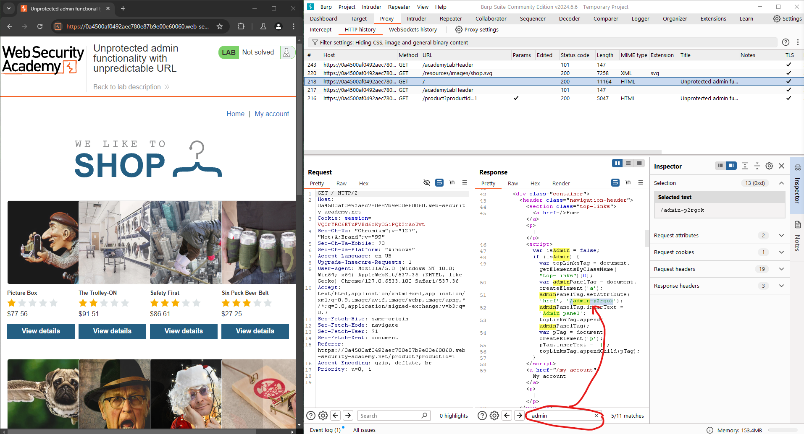
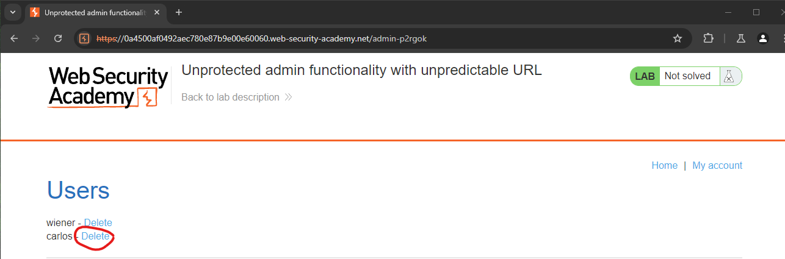

# Unprotected admin functionality with unpredictable URL

## Objective

In this lab, your goal is to exploit an unprotected admin panel with an unpredictable URL in order to delete the user "Carlos." This exercise will enhance your skills in identifying and exploiting insecure configurations in web applications.

## Step 1: Identifying the Admin Panel

To begin, we need to locate the admin panel, which is hidden behind an unpredictable URL. We do this by examining server responses for clues.

### Analyzing Responses

By analyzing the responses, I discovered that the home directory exposes a redirect to the admin panel. This was uncovered by searching for the keyword `admin`.

Once identified, follow the redirect to access the admin panel.

## Step 2: Deleting the User "Carlos"

Within the admin panel, our task is to delete Carlos's profile to complete the lab. Navigate to the user management section and delete Carlos's account.

## Conclusion

Congratulations on successfully completing your third lab in the series! By exploiting the unprotected admin panel, you’ve demonstrated your ability to find and leverage insecure configurations in web applications.
